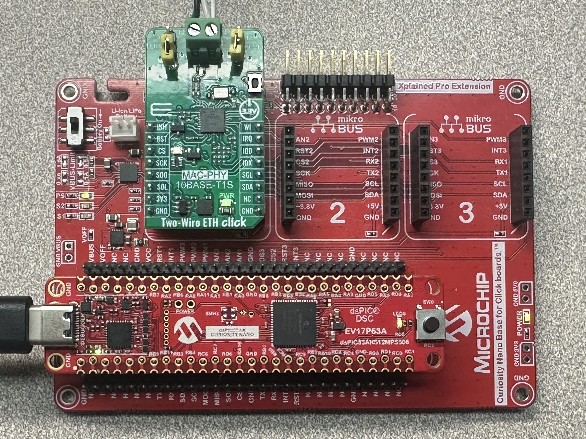

# lwIP TCP/IP example on dsPIC33AK512MPS506 using the LAN865x 10BASE-T1S Ethernet MAC-PHY

This example shows how to configure the LAN865x to be used in a 10BASE-T1S Multi-Drop
Ethernet network in either PLCA and CSMA/CD mode. It also shows how to r/w registers
of the LAN865x during normal operation.
Additionally, common Ethernet network functionalities are supported, e.g. ping and iperf.

## Building The Application
The parent folder for all the MPLAB X IDE projects for this application is given below:

**Application Path** : examples\lwIP-dsPIC33AK_Curiosity_Nano

To build the application, refer to the table below and open the appropriate project file
in MPLABX IDE.

| Project Name              | Description                                               |
| ---                       | ---                                                       |
| dsPIC33AK_Nano_tc6.X | Main project holding the board support package and running the bare metal application. This project pulls in liblwip.X and libtc6.X as libraries.  |
| liblwip.X  | lwIP TCP/IP stack library  |
| libtc6.X  | Container to build a library out of the libtc6 source code from the root folder  |

## Hardware setup



* Hardware used
    * [dsPIC33AK Curiosity Nano Board](https://www.microchip.com/en-us/development-tool/ev17p63a)
    * [Curiosity Nano Base for Click Boards](https://www.microchip.com/en-us/development-tool/ac164162)
    * [SPI to 10BASE-T1S interface card](https://www.mikroe.com/two-wire-eth-click)
* Hardware setup
    * Connect the PKoB4 USB port on the board to the computer using a USB-C cable.
    * Connect the SPI to 10BASE-T1S interface card to another 10BASE-T1S node (e.g. a second instance of this setup) and optionally a Linux device such as a Raspberry Pi with a EVB-LAN8670 USB device installed and driver loaded.
    * Ensure that end ends of the 10BASE-T1S link are terminated (jumpers installed) and any intermediate device is not terminated (jumpers removed).
    * Build and program one of the dsPIC33AK devices with the ```default``` configuration and the second with the ```node1``` configuration.  This sets up the first device to act as the 'beacon' on the 10BASE-T1S network (PLCA ID 0) and the second as PLCA ID 1.  This also sets the IP addresses for the devices to **192.168.0.100** (first device) and **192.168.0.101** (second device).

## Settings for LAN865x

PLCA Configuration is done via ```#define``` in the ```main.c``` file.

**MAC-PHY Settings**

The LAN865x MAC-PHY settings are at the beginning of the ```main.c``` file:

```
    #ifndef BOARD_INSTANCE
    #define BOARD_INSTANCE              (0)
    #endif

    #define T1S_PLCA_ENABLE             (true)
    #define T1S_PLCA_NODE_ID            (BOARD_INSTANCE)
    #define T1S_PLCA_NODE_COUNT         (8)
    #define T1S_PLCA_BURST_COUNT        (0)
    #define T1S_PLCA_BURST_TIMER        (0x80)
    #define MAC_PROMISCUOUS_MODE        (false)
    #define MAC_TX_CUT_THROUGH          (true)
    #define MAC_RX_CUT_THROUGH          (false)
    #define DELAY_BEACON_CHECK          (1000)
    #define DELAY_LED                   (333)
```

The value of ```BOARD_INSTANCE``` is set in the ```default``` and ```node1``` project configurations, but can be overriden here by defining ```BOARD_INSTANCE``` as desired.

---

**PLCA Settings**

10BASE-T1S can be used in PLCA or CSMA/CD mode.
  * When using PLCA, the parameters for **Local Node ID**, **Node Count**, **Max Burst Count** and **Burst Timer** must be configured.  These are controlled by the values of the ```#define``` settings listed above.
  * The application defaults to using PLCA mode.

## Running the Application

1. Open a Terminal application (e.g. Tera Term) on the computer.
2. Connect to the COM port and configure the serial settings as follows:
    * Baud: **115200**
    * Data: **8 Bits**
    * Parity: **None**
    * Stop: **1 Bit**
    * Flow Control: **None**
3. Build and program the application using the MPLAB X IDE.
    * Program the first device with the ```default``` configuration, and the second with the ```node1``` configuration.
4. Once both devices are programmed, use the Raspberry Pi (if available) to attempt to ping each device or start the ping test on each device.  If a reply is received, the devices are communicating properly on the 10BASE-T1S network.

---

**Application Features**

* Pressing the ```m``` key will display a menu with the available commands.
* Pressing the ```r``` key, or pressing the button will reset the device.
* Pressing the ```c``` key will clear the terminal window.
* Pressing the ```i``` key will start the UDP iPerf test.  This test requires an iPerf server, commonly available in Linux distributions.  Pressing the ```i``` key again will stop the test.
* Pressing the ```p``` button will start the ping test.  The ping test sends ICMP ECHO (ping) messages to the other device (**192.168.0.100** -> **192.168.0.101**, and vice versa) until the ```p``` key is pressed again to stop the test.  The test reports successful and failed pings and a summary at the end of the test, similarly to the well-known ```ping``` operation in most operating systems.

